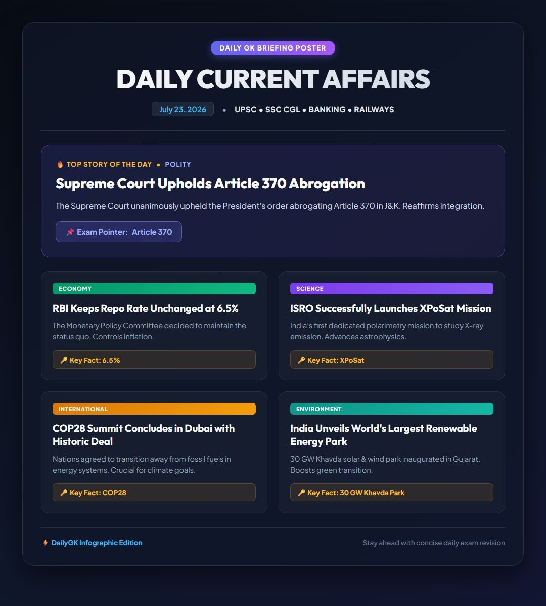

<div align="center">
  
  
  [](https://git.io/typing-svg)
</div>

<p align="center">
  <a href="#"></a>
  <a href="#"></a>
  <a href="#"></a>
  <a href="#"></a>
</p>

---

## 🌟 About the Project

**DailyGK** is a fully automated, AI-powered intelligence pipeline built to help students prepare for competitive exams (UPSC, SSC, State PSCs, etc.) with zero daily manual effort. 

Every morning at exactly **6:00 AM IST**, the system wakes up via GitHub Actions, scrapes top current affairs, summarizes them using AI, designs a beautiful high-resolution newspaper infographic, and delivers it straight to a Telegram channel. It even follows up with automated native quizzes in the evening!

### ✨ Key Features
- 🤖 **AI Summarization:** Uses Gemini AI to digest long news articles into crispy, exam-relevant bullet points (Core Fact, Why It Matters, Key Takeaways).
- 🎨 **HD Infographic Posters:** Dynamically generates a modern high-resolution dark-mode poster layout featuring top story highlights, category-colored badges, key exam pointers, and PIL auto-cropping.
- 🚀 **Zero-Maintenance Delivery:** Runs entirely on GitHub Actions on a cron schedule. No servers to maintain!
- 📊 **Telegram Integration:** Seamlessly posts the generated infographic, detailed text breakdowns, and native interactive Quiz Polls to Telegram.
- 📚 **Weekly Revisions:** Automatically compiles and sends an end-of-week revision sheet every Sunday.

## 🛠️ Architecture & Workflow

1. **Ingestion (`src/ingestion`):** Fetches raw RSS feeds and news sources based on configuration.
2. **Summarization (`src/summarization`):** Passes articles through Gemini AI for intelligent parsing and formatting.
3. **Storage (`src/storage`):** Saves structured facts into a local SQLite database (`data/dailygk.db`), automatically committing it back to the repo.
4. **Delivery (`src/delivery`):** 
   - **Morning Pipeline (6:00 AM IST):** Generates the infographic and pushes daily news to Telegram.
   - **Evening Pipeline:** Generates and sends a native Telegram Quiz Poll to test retention.

## 📸 Preview

Here is a sample of the automatically generated morning infographic:



## 🚀 Getting Started

### Prerequisites
- Python 3.10+
- Telegram Bot Token & Channel ID
- Google Gemini API Key

### Installation

```bash
# Clone the repository
git clone https://github.com/Varshitha61/DailyGK.git
cd DailyGK

# Install dependencies
pip install -r requirements.txt
```

### Configuration
Create a `.env` file in the root directory:
```env
TELEGRAM_BOT_TOKEN=your_bot_token_here
GEMINI_API_KEY=your_gemini_api_key_here
```
Update `config/settings.yaml` with your preferred Telegram Channel ID and news sources.

<div align="center">
  
</div>
